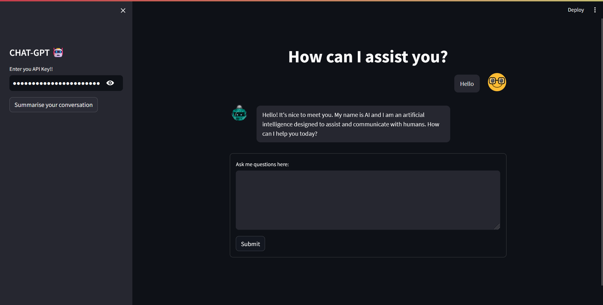
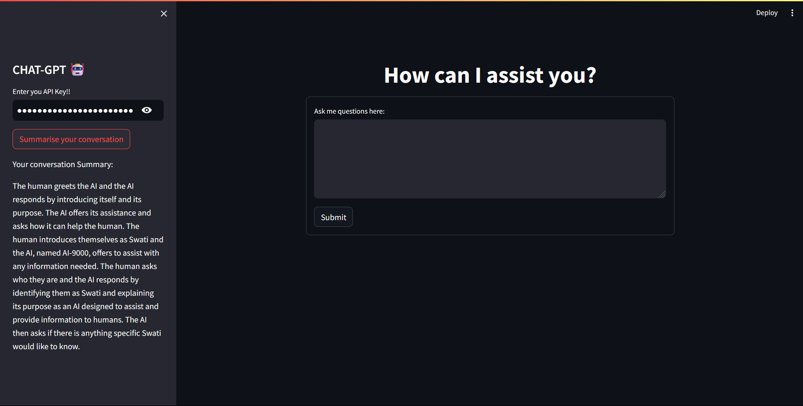

# ChatGPT Clone

This is a clone of OpenAI's GPT-3.5 Turbo model for chat applications. It uses the LangChain LLM for language understanding and generation.

## Setup

1. Install the required packages using the command `pip install -r requirements.txt`
2. Run the app using the command `streamlit run app.py`

## Usage

Enter your API key in the sidebar and start chatting with the bot. You can also summarise your conversation by clicking the "Summarise your conversation" button.

## Screenshots

## Future Updates

1. Chat can be displayed along with the chat summary.
2. Find a way to fix Memory Error when there is no chat history to summarise.